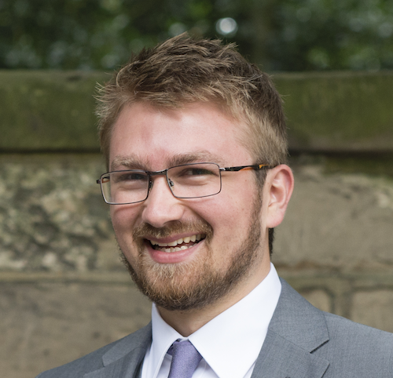

I am currently working for Gainsight as a Solutions Architect. I have 15+ years experience in solution design, product management, software development and line management of multiple teams.

Prior to working at Gainsight, I was the Head of Services at Upland Software where I managed the department in EMEA from our Coventry office. My department had 5 teams (19 people in total) and I reported to the General Manager EMEA.

In a previous role (Product Management Team Lead) at Adestra, I worked with the Head of Product Management and COO on the product roadmap, facilitating meetings with the commercial teams every month so they were kept up-to-date on the progress.

At Upland, my team had revenue targets to meet and my main focus was making sure that the projects we were managing were delivered on time and on budget. I acted as an escalation point for all clients who interacted with the team.

I have a software development background using Perl programming language and PostgreSQL database, Git and Subversion for Version Control, JIRA, Confluence and BitBucket for development framework and sprint planning.

When Upland Software acquired Adestra and Rant & Rave, I was involved in the employee consultations, so I have first hand experience with detailing out organisational changes in a sensitive manner.

I’m highly experienced in developing custom reporting and data integrations, having worked with many organisations on delivering technical solutions to real business challenges and goals.

I enjoy mentoring, problem solving and motivating myself, which I feel plays a key part in learning programming languages and creating bespoke solutions.

Having received positive feedback from Adestra’s Leadership team and being seen as a reference point by other senior managers and colleagues across the organisation, I was voted Adestra's employee of the year in 2007, 2014, 2015, 2017 and 2018.
